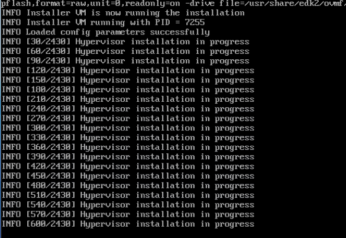
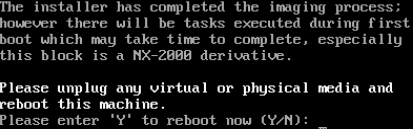
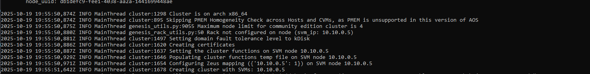
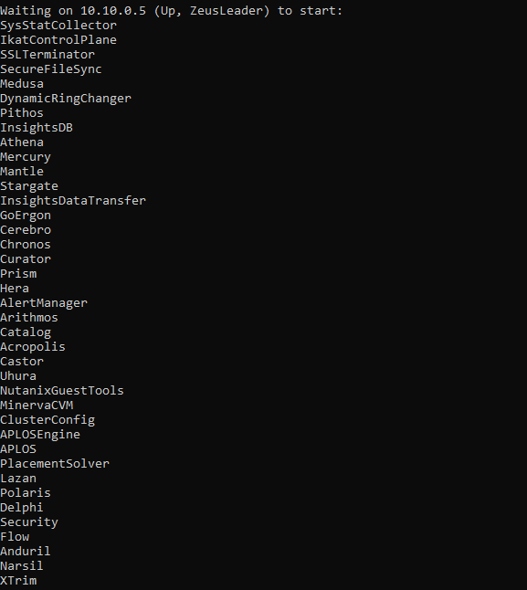
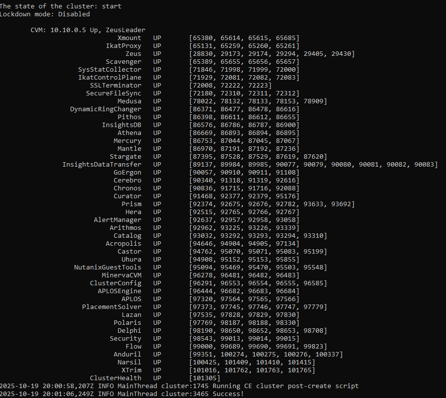
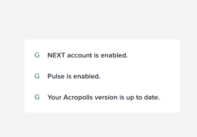
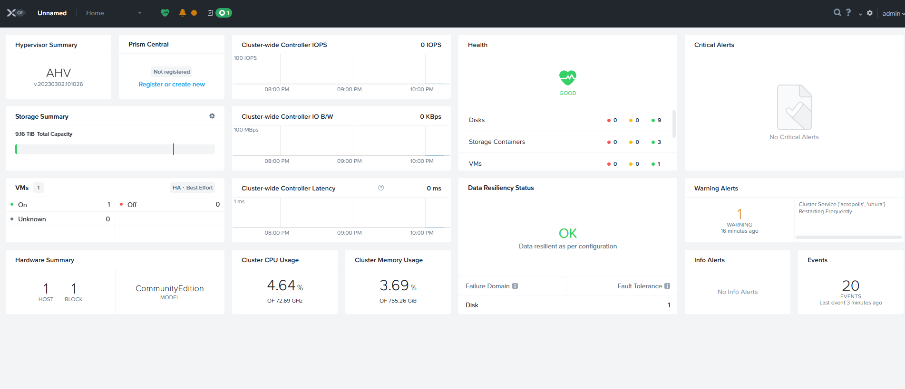
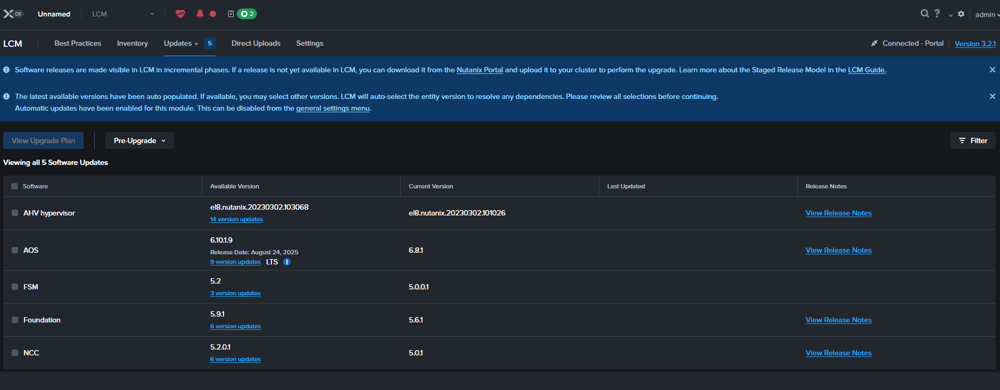

# Nutanix-Hogent
Full Nutanix stack: AHV+CVM+PC. Optional extra tasks like network segmentation and overlay networking using the Network Controller.
(Those who know me well enough know I shove some NSX overlay networking into everything. It's not a problem, it's a lifestyle.)

## Notice
- I will use the terms AHV, CVM, and PC during this guide. You should already know the first two. If you don't, we need to have a talk. PC refers to Prism Central.
- Everybody lies. Especially error messages. Keep that in mind.

## What do you need?
- Courage
- No fear (they're different, trust me)
- Any Dell or HPE server with Xeon E5 v3s or v4s (preferably one that actually boots)
- Nutanix CE account and ISOs (more on this later, patience)
- One SSD (>128GB) for AHV
- One SSD (>512GB) for CVM+PC
- Common sense (optional, but highly recommended. Surprisingly rare.)

## Nutanix Account
- Notice: One per team is enough. Share nicely. Or don't. I'm not here to teach you manners.
- Head over to this [link](https://my.nutanix.com/page/signup)
- Create a new account. Once it's confirmed by email, head to [this link](https://next.nutanix.com/discussion-forum-14/download-community-edition-38417)
- Download the installer ISO and the VirtIO for Windows ISO. Keep the VirtIO file for later. Yes, you'll need it. No, don't ask when. Trust the process.
- Make sure to remember your account credentials. Write them down. Tattoo them on your arm. Whatever works. Just don't blame me when you forget.

## Flashing the ISO
- Think this will be easy? Well, it is, IF you read the docs. #rtfm, am I right?
- There's currently a bug in Rufus versions above 3.21. Use an older version, or switch to Unetbootin or Win32DiskImager. [Source](https://portal.nutanix.com/page/documents/details?targetId=Nutanix-Community-Edition-Getting-Started-v2_1:top-installing-ce-t.html)
- Disable Secure Boot. Use legacy boot mode this time. It works better for Nutanix. Yes, we're going old school. Like vinyl records, but for servers.
- If it's not working, it's probably user error. It's always user error. Don't take it personally.

# Installing AHV
- Here comes the fun part: waiting. Tududud~~~~ (Hum the Jeopardy theme if it helps.)
- When the waiting is done, you'll get a disk selection screen. Do as I say, not as I do. Seriously. I've made enough mistakes for both of us.
- Use the smallest SSD for boot/hypervisor (H)
- Use the larger SSD for CVM (C)
- Use any other HDDs for data (D)
- DO NOT CLICK NEXT (I know you want to. The urge is strong. Resist. Be better.)
- Double check everything. Assign two IP addresses accessible on VLAN0 (untagged): one for the CVM and one for AHV.
- I always use 10.10.0.1/24. CIDR notation. Look it up if you're not familiar. Google is your friend. Use it.
- So I set AHV to 10.10.0.4, and CVM to 10.10.0.5. PC will later be set to 10.10.0.8. Simple, right? Right.
- STILL DO NOT CLICK NEXT
- Have your config double checked by the responsible person (the supervisor, not to be confused with hypervisor). Get it approved. Cover your bases. Documentation saves lives. Or at least jobs.
- Hit install, and go take a one hour break. Yeah, that's how long it takes. Maybe even more. Go touch grass or something. Read a book. Question your life choices.

- Oh yay, it's done! I hope it worked as well as it did for me. If not... yikes. Call support. Or start Googling. Your call. Either way, you're on your own now.

- Notice: But won't HDDs be slow? Yes. Shockingly slow. Like watching paint dry. But Nutanix CE uses spare CVM space for caching, which works wonders for what we're doing. Almost as fast as me getting more coffee. Almost.
- Notice: If you have a boot SSD, it goes much faster. I've tested most things on a Kioxia CM6, which took about 25 minutes for the full install. Your mileage may vary. Probably will.
- After around 20-30 minutes, you'll see "INFO Hypervisor Installation in progress." That's the CVM being deployed. Relax. It knows what it's doing. Unlike most people.

## Starting the cluster
- SSH into AHV (10.10.0.4 for me) using the root user. Change the passwords for root, nutanix, and admin. The nutanix user will eventually be deprecated. Plan accordingly.
- Do the same on the CVM (10.10.0.5). Make sure to remember your passwords. They can be the same. Or not. I'm not your mom.
- DO THIS BEFORE PROCEEDING. MODIFYING THE PASSWORDS AFTERWARDS REQUIRES A MORE COMPLEX APPROACH AS THEY ARE LINKED IN DATABASES ELSEWHERE.
- YOU HAVE BEEN WARNED. Don't say I didn't tell you. I did. Right here. In caps. Can't miss it.
- Exit the CVM, and SSH into it again using the admin user.
- Run the magic command: `cluster -s CVM_IP --redundancy_factor=2 create` (where CVM_IP is the IP of your CVM. In my case, 10.10.0.5. Don't overthink it. Overthinking is the enemy of progress.)
- Doing so should give you a line about "Cluster:XXXX Will seed prism with password hash...." If it does, you're golden. If not, well, that's why Google exists.

- This took about 100 seconds on my NVMe system. Shouldn't take much longer. After a while, you'll get a list like this:

- This basically means it's waiting for all the newly set up services to start. Sit back and enjoy some more coffee. Or tea. (You know who you are. Yes, you.)
- This can take another few minutes. Mine took about 15. But do not worry. We're almost there. Deep breaths. In through the nose, out through the mouth.

- And we're done! Or are we? (Spoiler: we're never done.)
- Set a timer for 5 minutes. This makes sure all services are fully up and running. Feel free to read ahead, work on the documentation, or Google how Nutanix and HCI work. Knowledge is power. Power is good. Be powerful.
- New Achievement Unlocked: Full Nutanix CE install. Or are we there yet? The answer is always no.

# Nutanix WebUI

## Where?
- Simple. Navigate to `https://CVM-IP:9440`
- Log in with the admin username and password you set. Remember those? Good. Gold star for you.
- First time you do this, it'll ask you to link your Next account. This is the Nutanix account you created earlier. Pay attention. I know it's hard, but try.

- After this, you arrive at the dashboard. Yay! Confetti! Jazz hands! Look at you, all grown up and deploying infrastructure.
- I always get the "Cluster Service ['acropolis', 'uhura'] Restarting Frequently" warning. Ignore it. It goes away. It's a side effect from the older version we use. Annoying, but harmless. Like that coworker who microwaves fish in the break room.

- Something you'll notice: critical alerts about disks not being supported. We'll address this later. For now, ignore it. Pretend it's not there. Ignorance is bliss. Bliss is underrated.

## LCM and Updates
"Nutanix Life Cycle Manager (LCM) is a tool that automates the process of upgrading Nutanix software and component firmware across a cluster." – some AI that thinks it's smart. It's not. But it tries.

- Head over to LCM. Try to run an inventory. See what happens. Live dangerously.
- You can update, but don't. Only at the end of all tasks if you have free time. Takes about an hour. Use that time wisely. Or don't. I'm not your therapist.
- You'll see two version schemes: one with a full date, and AHV 10.x. Google how that works. I'm not your teacher. I'm barely qualified to be your guide.

# Deploying Prism Central
"Prism Central provides a workspace to monitor and manage multiple clusters from a centralized environment. It runs as a separate instance that consists of either a single VM or as a three-VM scale-out architecture."

Translation: It's a manager for multiple Nutanix clusters, with some added tools and tricks. Any big scale deployment will use Prism Central, not the built-in mini version. Think of it as the difference between a toy car and a Ferrari. Or between aspirin and Vicodin.

There are two ways to deploy. We'll try the first one, the easiest one. If that doesn't work, we'll try the manual way. Do not fear. Documentation is here. Somewhere. Probably buried under seventeen tabs you forgot to close.

- I've found the automated one to be a tad unreliable. Maybe Nutanix doesn't care much about CE users. Maybe server reachability is just... meh. Who knows? Nobody tells me anything.

# And when you're finished?
Question yourself: are you truly ever finished? "Once upon a time, I alone dreamed in this world. Those who dream are the ones who never stop chasing what they believe in." Just like this, keep dreaming, exploring, and fixing. The journey never really ends. Spoiler alert: you're never done. Ever.

Because I see a lot of big errors in our Nutanix environment. Let's fix those, shall we? Because ignoring problems always works out great. Said no one ever.

The main one? Unsupported disks. Well, cause, you know, our disks aren't supported. Shocking, I know. But we know this. And we don't care. So let's properly get rid of this error. Because fake it till you make it is basically IT in a nutshell.

I would personally recommend doing your own research first. Flex those Google muscles. But if you can't find it, have a look under `~patches/hcl.json`. I've given an example that works, certified by yours truly. You're welcome. No need to thank me. But you can if you want.

# A Thank You Note, and Wishes
And that, my friends, is where our journeys pause for a moment to reflect on what we've built and what lies ahead. Though the paths may part here, the spirit of discovery and the drive for growth remain with each of us. Move forward with confidence, ready to face new challenges and embrace fresh opportunities. Until we meet again on some distant horizon (not to be confused with VMware Horizon, which is a whole different nightmare), may your curiosity never fade and your passion never wane. 

And that, my friends, is where our journeys part.

Now get out there and break something. Then fix it. That's how we learn. It's also how we justify our existence.
-Aurora R.
