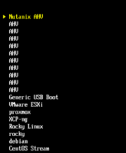

# Nutanix-Hogent
Full Nutanix stack: AHV+CVM+PC. Optional extra tasks like network segmentation and overlay networking using the Network Controller.
(Those who know me well enough know I shove some NSX overlay networking into everything. It's not a problem, it's a lifestyle.)

## Notice
- I will use the terms AHV, CVM, and PC during this guide. You should already know the first two. If you don't, we need to have a talk. PC refers to Prism Central.
- Everybody lies. Especially error messages. Keep that in mind.

## Deployment War Stories
- **17 full runs** of this circus, because who doesn’t love déjà vu?  
- Total time invested: roughly 68 hours of staring at progress bars, 118 cups of coffee, and enough existential dread to power a small moon.  
- Moral of the story: repetition is the mother of competence, or insanity. You decide.

## What do you need?
- Courage
- No fear (they're different, trust me)
- Any Dell or HPE server with Xeon E5 v3s or v4s (preferably one that actually boots)
- Nutanix CE account and ISOs (more on this later, patience)
- One SSD (>128GB) for AHV (Can be an HDD)
- One SSD (>200GB) for CVM+PC
- Common sense (optional, but highly recommended. Surprisingly rare.)

## Nutanix Account
- Notice: One per team is enough. Share nicely. Or don't. I'm not here to teach you manners.
- Head over to this [link](https://my.nutanix.com/page/signup)
- Create a new account. Once it's confirmed by email, head to [this link](https://next.nutanix.com/discussion-forum-14/download-community-edition-38417)
- Download the installer ISO and the VirtIO for Windows ISO. Keep the VirtIO file for later. Yes, you'll need it. No, don't ask when. Trust the process.
- Make sure to remember your account credentials. Write them down. Tattoo them on your arm. Whatever works. Just don't blame me when you forget.

## Flashing the ISO
- Think this will be easy? Well, it is, IF you read the docs. #rtfm, am I right?
- There's currently a bug in Rufus versions above 3.21. Use an older version, or switch to Unetbootin or Win32DiskImager. [Source](https://portal.nutanix.com/page/documents/details?targetId=Nutanix-Community-Edition-Getting-Started-v2_1:top-installing-ce-t.html)
- Disable Secure Boot. Use legacy boot mode this time. It works better for Nutanix. Yes, we're going old school. Like vinyl records, but for servers.
- If it's not working, it's probably user error. It's always user error. Don't take it personally.

# Installing AHV
- Here comes the fun part: waiting. Tududud~~~~ (Hum the Jeopardy theme if it helps.)
- When the waiting is done, you'll get a disk selection screen. Do as I say, not as I do. Seriously. I've made enough mistakes for both of us.
- Use the smallest SSD for boot/hypervisor (H)
- Or, if you don't have 10 bucks to spend on an 256gb ssd, use an hdd, but i mean, you do you ^_^
- Use the larger SSD for CVM (C)
- Use any other HDDs for data (D)
- DO NOT CLICK NEXT (I know you want to. The urge is strong. Resist. Be better.)
- Double check everything. Assign two IP addresses accessible on VLAN0 (untagged): one for the CVM and one for AHV.
- I stick with 10.10.0.1/24. It’s called CIDR notation. Look it up. That’s what search engines are for.
- So I set AHV to 10.10.0.4, and CVM to 10.10.0.5. PC will later be set to 10.10.0.8. Simple, right? Right.
- STILL DO NOT CLICK NEXT

- Get your config reviewed by the person who’s actually in charge. Not the hypervisor; that joke stopped being funny after VMware 5.5. Get it approved. Cover yourself. Paperwork won’t save the world, but it’ll save your job.
- Hit install and walk away. An hour, maybe longer. Go admire some grass. Read something that isn’t a log file. Contemplate how your life led to watching progress bars for a living.

- Oh yay, it's done! I hope it worked as well as it did for me. If not... yikes. Call support. Or start Googling. Your call. Either way, you're on your own now.

- Notice: But won't HDDs be slow? Yes. Shockingly slow. Like watching paint dry. But Nutanix CE uses spare CVM space for caching, which works wonders for what we're doing. Almost as fast as me getting more coffee. Almost.
- Notice: If you have a boot SSD, it goes much faster. I've tested most things on a Kioxia CM6, which took about 25 minutes for the full install. Your mileage may vary. Probably will.
- After around 20-30 minutes, you'll see "INFO Hypervisor Installation in progress." That's the CVM being deployed. Relax. It knows what it's doing. Unlike most people.

## Starting the cluster
- SSH into AHV (10.10.0.4 for me) using the admin user. Change the passwords for root, nutanix, and admin. The nutanix user will eventually be deprecated. Plan accordingly. Evolution doesn't care about your nostalgia.
- Do the same on the CVM (10.10.0.5). Make sure to remember your passwords. Use different ones if you're feeling paranoid. I'm not here to judge your security theater.
- DO THIS BEFORE PROCEEDING. CHANGING PASSWORDS AFTER CLUSTER CREATION REQUIRES A MORE COMPLEX APPROACH BECAUSE THEY'RE HARDCODED IN DATABASES SCATTERED ACROSS THE INFRASTRUCTURE LIKE EASTER EGGS NOBODY WANTED.
- YOU HAVE BEEN WARNED. Don't come crying later. I told you. Right here. In caps. With emphasis. Reading is fundamental.
- So, you’ve just spent half an hour trying to change the passwords. Great news: you’re now officially slower than the cluster. Congratulations. If you somehow did it faster, run 'genesis status' and make sure at least Foundation is actually running. Don’t trust optimism.
- Run the magic incantation: `cluster -s CVM_IP --redundancy_factor=1 create` (where CVM_IP is your CVM's IP. Mine's 10.10.0.5. Yours isn't. Use yours. Pattern recognition isn't rocket science.)
- You should see a line about "Cluster:XXXX Will seed prism with password hash...." If you do, congratulations—you followed instructions. If not, that's what search engines were invented for. Use them. They won't judge you. I will.

- This took about 1 seconds on my NVMe rig. If yours is slower, you’re either on a potato or you like watching paint dry. After a bit, you’ll see something like this:

- This basically means it's waiting for all the newly set up services to start. Sit back and enjoy some more coffee. Or tea. (You know who you are. Yes, you.)
- This can take another few minutes. Mine took about 15. But do not worry. We're almost there. Deep breaths. In through the nose, out through the mouth.

- And voilà. Done. Or not. (Hint: you’re never actually done.)
- Set a five-minute timer. That’s your “all-systems-go” assurance. Use it to update docs, Google how Nutanix and HCI work, or ponder life’s great mysteries. Knowledge is power. Power is good. Be powerful.
- New Achievement Unlocked: Full Nutanix CE install. Progress? Sort of. Endgame? Never.

# Nutanix WebUI

## Where?
- Simple. Navigate to `https://CVM-IP:9440`
- Log in with the admin username and password you set. Remember those? Good. Gold star for you.
- First time you do this, it'll ask you to link your Next account. This is the Nutanix account you created earlier. Pay attention. I know it's hard, but try.

- After this, you arrive at the dashboard. Yay! Confetti! Jazz hands! Look at you, all grown up and deploying infrastructure.
- I always get the "Cluster Service ['acropolis', 'uhura'] Restarting Frequently" warning. Ignore it. It goes away. It's a side effect from the older version we use. Annoying, but harmless. Like that coworker who microwaves fish in the break room.

- Something you'll notice: critical alerts about disks not being supported. We'll address this later. For now, ignore it. Pretend it's not there. Ignorance is bliss. Bliss is underrated.

## LCM and Updates
"Nutanix Life Cycle Manager (LCM) is a tool that automates the process of upgrading Nutanix software and component firmware across a cluster." – some AI that thinks it's smart. It's not. But it tries.

- Head over to LCM. Try to run an inventory. See what happens. Live dangerously.
- You can update, but don't. Only at the end of all tasks if you have free time. Takes about an hour. Use that time wisely. Or don't. I'm not your therapist.
- You'll see two version schemes: one with a full date, and AHV 10.x. Google how that works. I'm not your teacher. I'm barely qualified to be your guide.

# Deploying Prism Central
"Prism Central provides a workspace to monitor and manage multiple clusters from a centralized environment. It runs as a separate instance that consists of either a single VM or as a three-VM scale-out architecture."

Translation: It's a manager for multiple Nutanix clusters, with some added tools and tricks. Any big scale deployment will use Prism Central, not the built-in mini version. Think of it as the difference between a toy car and a Ferrari. Or between aspirin and Vicodin.

There are two ways to deploy. We'll try the first one, the easiest one. If that doesn't work, we'll try the manual way. Do not fear. Documentation is here. Somewhere. Probably buried under seventeen tabs you forgot to close.

- I've found the automated one to be a tad unreliable. Maybe Nutanix doesn't care much about CE users. Maybe server reachability is just... meh. Who knows? Nobody tells me anything.

# Deploying Prism Central the Easy Way

First things first, head over to the dashboard and find the “Register or Create New” button. No, it’s not a trap. Click it, then hit “Deploy.” Easy, right? Almost too easy, but hey, we take what we can get.

Next, select the latest version available. Not necessarily the first one you see—this isn’t a game of shelf organization. Google which one that is or just pick the newest-looking. If you’re feeling adventurous, you can start moonlighting as a detective.

Choose the smallest footprint unless you’ve got 500+ hosts queued. You don’t. Stop flexing.

Assign that sucker a free IP address. Don’t pick the one your neighbor’s printer uses. Fill in a working NTP server, preferably AD if it’s not a museum relic.

Give it a working DNS server, too. Yes, like real DNS, not the “sometimes works” version. Nobody's holding your hand here; figure that out yourself. Welcome to IT.

You might need to create a new network. Fun, right? Welcome to the party. You’re officially on your own for this part. Good luck!

For the microservices configuration, leave everything at default. If it ain’t broke, don't fix it. If it breaks, well… you only have yourself to blame.

And remember; if anyone asks, you have this totally under control. I’ll be here, judging quietly in the background.

# Deploying Prism Central the Hard Way

Uuhm, well… it’s something with uploading a binary. Yeah. You read that right. Uploading a binary file. Like it’s 1999 all over again.

First, you’ll need to grab the Prism Central installation binary and metadata files. Where, you ask? Good question. I don’t have all the answers. Go figure it out yourself. Maybe check Nutanix portals, forums, or just ask your friendly neighborhood sysadmin—if you have one.

Next, you’ll upload those files to your cluster. SCP, SFTP, carrier pigeon, whatever floats your boat. Just don’t expect me to do it for you. I’ve got better things to do, like staring at logs and wondering why the moon still hasn’t exploded.

Once you’ve got those files cozy on your Prism Central VM, you’ll need to run an obscure CLI command that looks like someone smashed their keyboard. Something like this:

- ncli software upload software-type=PRISM_CENTRAL file-path=/home/nutanix/tmp/your-binary.tar.gz meta-file-path=/home/nutanix/tmp/your-metadata.json

Remember to replace those paths with the actual file names you've got. Misspelling anything will make the universe collapse. Or at least your deployment will fail spectacularly.

After that, your console will kindly inform you that the upload might take a while. That’s code for “grab a coffee, maybe a sandwich, or question your life choices.”

Finally, go back to the GUI, head to the Prism Central upgrade section, and miracle of miracles, you should see your shiny new upload ready to be deployed. Click through the usual prompts, ignore any strange warnings, and hope for the best.

So yeah, this “hard way” isn’t exactly fun, isn’t beginner-friendly, and definitely doesn’t come with a neat button that says “Make it so.” But hey, it builds character. Or wrinkles. One of those.

Good luck. You’re gonna need it.

# And When You’re Finished?

Ask yourself if you’re done, or just tired of looking at the problem. “But in the hidden corners where the gods’ gaze does not fall, there are those who dream of dreaming.” Keep going. Poke the thing. Fix the thing. Pretend there is a finish line if it helps you sleep.

This Nutanix setup is not tragic, it is predictable. You can fix it, or you can blame the network and hope no one notices. Your move.

Unsupported disks are the headline act. Yes, they are unsupported. No, that is not interesting. We will patch around it; we will call it intentional; you will nod and move on. In IT, “fake it till you make it” is not a motto, it is in the job description.

Step one: use Google like a professional. Step two: if that fails, open `~patches/hcl.json`. There is a working example waiting. Consider it a parting gift, not a habit you should develop.

# A Thank You Note (and a Reality Check)

This is the part where paths split. You take yours, I take mine. You will be fine, or you will learn something painful and useful. Both outcomes are acceptable.

Walk forward with a little arrogance and a lot of backups. Break something carefully, then fix it before anyone notices. That is how you get better, and how you keep the badge.

And that, my friends, that is where our journeys part.

-Aurora R.

