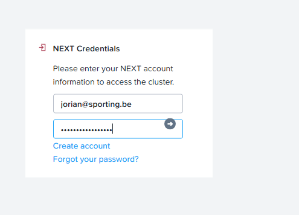

# Nutanix-Hogent
Full Nutanix stack, AHV+CVM+PC. Optional extra tasks like network segmentation and overlay networking using the Network Controller.
(Those who know me well enough know I shove some NSX overlay networking into everything.)

## Notice
- I will use the terms AHV,CVM,and PC during this guide. You should already know the first two, but "PC" refers to Prism Central.

## What do you need?
- Courage.
- No fear.
- Any dell or Hpe server with Xeon E5-v3s or E5-v4s.
- Nutanix CE account and iso's, more on this later.
- One ssd (<128gb), for AHV.
- One ssd (<512gb), for CVM+PC.

## Nutanix Account
- Notice: One per team is enough.
- Head over to this: [link](https://my.nutanix.com/page/signup).
- Create a new account. Once it is confirmed by email, head to: [link](https://next.nutanix.com/discussion-forum-14/download-community-edition-38417).
- Download the installer ISO and the VirtIO for Windows ISO. Keep the VirtIO file for later.
- Make sure to remember your account since you'll need it later.

## Flashing the ISO
- Think this will be easy? Well, it is—if you read the docs! #rtfm, am I right?
- There is currently a bug in Rufus versions above 3.21, so use an older version, or use Unetbootin or Win32DiskImager. [source](https://portal.nutanix.com/page/documents/details?targetId=Nutanix-Community-Edition-Getting-Started-v2_1:top-installing-ce-t.html)
- Make sure to disable Secure Boot, use legacy boot mode this time; it works better for Nutanix.

# Installing AHV
- Here comes the fun part, waiting... tududud~~~~
- When the waiting is done, you’ll get a disk selection screen. Do as I say, not as I do!
- Use the smallest SSD for boot/hypervisor (H).
- Use the larger SSD for CVM (C).
- Use any other HDDs for data (D).
- DO NOT CLICK NEXT!
- Double check everything, assign 2 ips that'll be accesible on vlan0 (untagged); one for the CVM and one for AHV.
- I always use 10.10.0.1/24 (CIDR notation—look it up if you’re not familiar!).
- So i set AHV to 10.10.0.4, and CVM to 10.10.0.5, PC will later be set to 10.10.0.8.
- STILL DO NOT CLICK NEXT!
- Have your config double checked by the responsible person; the supervisor. Not to be confused with hypervisor! ^_^
- Hit install, and go take a 1 hour break, yeah that's how long it takes, maybe even more.

- Oh yay it's done! I hope it worked as well as it did for me, if not, uuuhm. Yikes, call support.

- Notice: But won’t HDDs be slow? Yes, but Nutanix CE uses spare CVM space for caching, which works wonders for what we’re doing. Almost as fast as me getting more coffee. ^_^
- Notice: If you have a boot SSD, it goes much faster. I’ve tested most things on a Kioxia CM6, which took about 25 min for the full install.
- After around 20-30 min you'll see "INFO Hypervisor Installation in progress". That's the CVM being deployed....

## Starting the cluster.
- SSH into AHV (10.10.0.4 for me), use the Nutanix user. change the password of root, nutanix, and admin. The nutanix user will eventually be deprecated.
- Do the same on the CVM (10.10.0.5). Make sure to remember your passwords; they can be the same.
- DO THIS BEFORE PROCEEDING, MODIFYING THE PASSWORDS AFTERWARDS REQUIRE A MORE COMPLEX APPROACH AS THEY ARE LINKED IN DATABASES ELSEWHERE
- YOU HAVE BEEN WARNED
- Exit the CVM, and SSH into it again using the Nutanix user.
- Run the magic command: cluster -s CVM_IP --redundancy_factor=2 create (where CVM_IP is.... The bloody ip of your one cvm! So in my case 10.10.0.5)
- Doing so should give a line about Cluster:XXXX Will seed prism with password hash....

- This took about 100 sec~ on my NVMe system. Shouldn't take much longer, after a while you'll get a list like this:

- This basically means it's waiting for all the newly set up services to start, so sit back and enjoy some more coffee, or tea (you know who you are!).
- This can take another few minutes, took mine about 15 of them! But do not worry, we're almost there!

- And we're done!
- Set a timer for 5 min, this makes sure all services are fully up and running, feel free to read a bit ahead, work on the documentation, or google a bit about how Nutanix and HCI work (:
- New Achievement: Full Nutanix CE install, or are we there?

# Nutanix WebUI

## Where?
- Simple, navigate to https://CVM-IP:9440.
- Log in with your set admin user and password.
- First time you do this, it'll ask you link your next account, this is the Nutanix account you created earlier.

- After this you arrive at the dasboard, yay!
- I always got the "Cluster Service ['acropolis', 'uhura'] Restarting Frequently" warning, ignore it, it goes away, it's a side effect from the older version we use.

- Something you'll notice is some critical allerts about disks not being supported, we will address this issue later, but we can safely ignore it.

## LCM and updates
"Nutanix Life Cycle Manager (LCM) is a tool that automates the process of upgrading Nutanix software and component firmware across a cluster." - whack ass AI.

- Head over to LCM, try to run an inventory
- You can Update, but do not, only at the end of all tasks if you have free time. Takes about an hour.
- You'll see two version schemes, the one with a full date in them, and AHV 10.x. Have a google about how that works.

# Deploying Prism Central
"Prism Central provides a workspace to monitor and manage multiple clusters from a centralized environment. It runs as a separate instance that consists of either a single VM or as a three-VM scale-out architecture."
So in easier words: It's a manager for multiple Nutanix Clusters, with some added tools and tricks. Any big scale will use Prism and not the in build mini version.
There's 2 ways to deploy, we'll try the first one, the easiest one. If that doesn't work, we'll try the manual way. Do not fear, documentation is here!
- I've found The aumated one to be a tad unreliable, maybe Nutanix doesn't care much about CE users, and server reachability is eh meh eh.

# And when you're finished?
Question yourself: are you truly ever finished? “Once upon a time, I alone dreamed in this world. Those who dream are the ones who never stop chasing what they believe in.” Just like this, keep dreaming, exploring, and fixing; the journey never really ends. 

Because i see a lot of big errors in our nutanix environement, let's fix those!
The main one is about unsupported disks, well, cause, you know. Our disks aren't supported. But we know, and we don't care, so let's properly get rid of this error.
I would personally recommend to do your own research first. But if you can't find it, have a look under ~patches/hcl.json, i've given an example that works, certified by yours truly. ^_^

# A thank you-note, and wishes
And that, my friends, is where our journeys pause for a moment; to merely reflect on what we’ve built and what lies ahead. Though the paths may part here, the spirit of discovery and the drive for growth remain with each of us. Move forward with confidence, ready to face new challenges and embrace fresh opportunities. Until we meet again on some distant horizon (not to be confused with vmware Horizon), may your curiosity never fade and your passion never wane. And that, my friends, that is where our journeys part.
